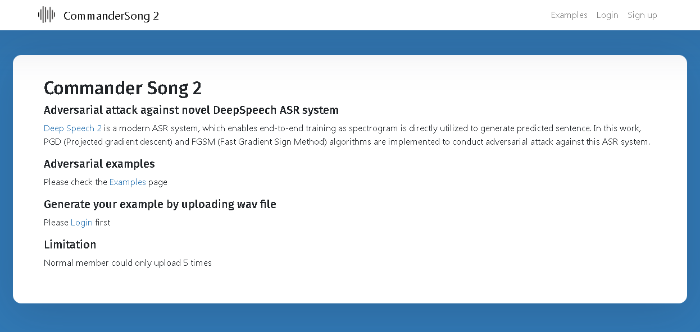

# PyTorch Commander Song 2 React Web Service

## Introduction
This repo provide a web service for adversarial sound examples generation against deep speech 2 ASR model. For more attacking technigue information, please refer to this [link](https://github.com/Kaminyou/deepspeech2-pytorch-adversarial-attack), which mainly focuses on how to use PyTorch to generate adversarial examples.

## Setup frontend
The frontend is mainly based on naive `React` and easily to be built up. You must first create a `config.json` file in `frontend/src/config.json/`, which would be like
```json
{
    "SERVER_URL": "backend server url"
}
```
Then, install all dependencies
```script
cd frontend
yarn
```
Finally, start the fronend server
```script
yarn start
```
## Setup backend
The backend is mainly based on `flask`. To run the backend server, you must first setup several dependencies! Please refer to this [link](https://github.com/Kaminyou/deepspeech2-pytorch-adversarial-attack) to install `deepspeech.pytorch` first. Also, it is recommended to run this project on Anaconda environment with PyTorch installation. Besides, you **MUST have GPU** on your server to make sure all the process would run appropriately.</br>
Afterward, two secret files should be created.
1. backend/args.py
```python
class Args(object):
    def __init__(self):
        self.model_path = "/path_to_the_model/librispeech_pretrained_v2.pth"
        self.device = "cuda"

```
2. backend/utils/secret.py
```python
class Secret(object):
    def __init__(self):
        self.account = "admin"
        self.password = "set_admin_password"
        self.level = "admin"
        self.gift = "secret_token_for_invited_user"
```
You can delete the existing database in `backend/sqlite_db/adv_sound.sqlite` cause you would never know the password. Then, initilize the new database by
```script
python3 init_db.py
```
Now, everything is prepared. The backend server can be easily run by
```script
python3 server.py
```